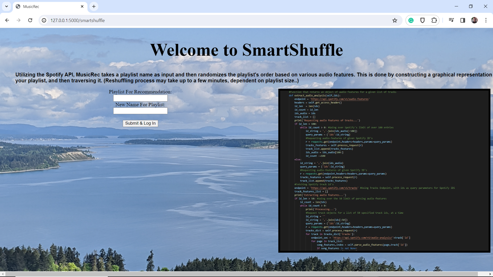
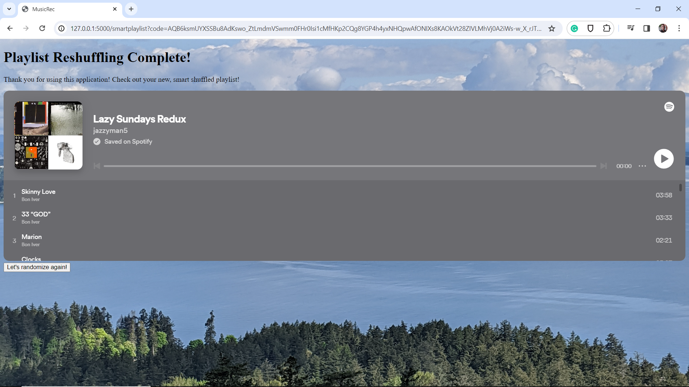

# Smart Shuffle (Web Application using Python and Flask)

## A functional Python-based software application that generates randomized Spotify playlist shuffles using its content's song attributes and a given user playlist

### :toolbox: Languages and Tools

&nbsp;

This project was done for an academic project in coordination with a computer science faculty member. Given a Spotify account, the application selects a user playlist as desired and generates a tracklist sequence based on its metadata from each individual song. The full program executes the following:

* Creates frontend web pages for user sign-in and playlist selection
* Backend executes authorized sign-in and metadata retrieval by communicating with Spotify API
* Organizes fetched metadata and performs list processing given certain parameters
* Saves the new shuffled playlist into the user library without modification of the source playlist
* Can graph specific playlist attributes over the course of the tracklist as a visual aid (IMPLEMENTATION INFORMATION COMING SOON)
---
## Application Usage Summary

After you initialize the program and go to the hosting address, you will be shown a lander page that requests you to select a playlist by name that you want to be shuffled and what the newly generated playlist name will be. After you submit, the application will ask you to sign into your Spotify account and authorize access to your playlists for modification.

After successful completion, you will be taken to the final page that will display your newly shuffled playlist. Giving you the option to select another playlist again if you wish.

---
## Installation Instructions
1. Clone this project
2. Setup a local directory for executable creation
3. Setup a programming environment via Anaconda or a similar bash shell with the repository's .YML file
4. You must set up a Spotify Developer account with your own user ID and secret key, which must be updated in __init__.py
5. Run smartshufflesetup.py on localhost or set it up on an alternative hosting platform i.e. PythonAnywhere
